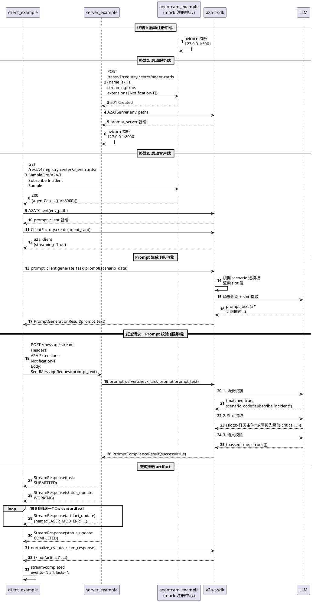

# A2A-T Sample

基于 a2a-t-sdk 的最小端到端示例，演示**流式告警订阅**场景：客户端生成 prompt → 服务端校验 → 流式推送 Incident artifact。

[English](README.md)

## 目录结构

```
a2a-t-sample/
├── src/
│   ├── agentcard_example/   # mock 注册中心（AgentCard 注册/查询）
│   ├── client_example/      # 客户端（发现 agent + 生成 prompt + 消费流）
│   ├── server_example/      # 服务端（注册 agent + 校验 prompt + 推送 artifact）
│   └── common/              # 公共模块（LLM 日志、mock、a2a 适配器等）
├── test/                    # 单元测试
├── resources/
│   └── mock_responses/      # mock LLM 响应数据（zh-CN / en-US）
├── env.example              # 环境配置模板
├── requirements.txt         # sample 依赖
└── ruff.toml                # lint 配置
```

## 快速开始

### 1. 准备环境

```bash
cd a2a-t-sample
cp env.example .env
```

编辑 `.env`，填入你的 LLM API Key：

```
A2AT_LLM_API_KEY=sk-your-real-key
```

> 如果不填 key（留空），sample 会自动使用 mock LLM 响应，无需真实 API 即可跑通完整流程。

### 2. 安装依赖

```bash
uv pip install -r requirements.txt
```

### 3. 启动服务（三个终端）

```bash
# 终端1：启动注册中心
uv run python -m agentcard_example.registry_main

# 终端2：启动服务端
uv run python -m server_example.server_main

# 终端3：启动客户端
uv run python -m client_example.client_main
```

客户端会持续接收 artifact，按 `Ctrl+C` 停止。

### 4. 限制接收数量（可选）

通过环境变量控制客户端接收多少个 artifact 后自动停止：

```bash
A2AT_SAMPLE_MAX_ARTIFACTS=5 uv run python -m client_example.client_main
```

## 时序图



## 流程说明

| 阶段 | 谁调 SDK | SDK 做什么 | LLM 调用次数 |
|------|---------|-----------|-------------|
| 启动 | client + server | A2ATClient / A2ATServer 初始化 | 0 |
| Prompt 生成 | 客户端 | 场景识别 + slot 提取 + 模板渲染 | 2 |
| Prompt 校验 | 服务端 | 场景识别 → slot 提取 → 语义校验 | 3 |
| 流式推送 | 客户端 | normalize_event 归一化 stream 事件 | 0 |

## Mock LLM

当 `A2AT_LLM_API_KEY` 为空时，sample 自动使用 `resources/mock_responses/` 下的预置响应数据，无需真实 API key 即可跑通完整流程。Mock 响应按语言（`zh-CN` / `en-US`）分目录，与 `.env` 中的 `A2AT_LANGUAGE` 对应。

## 关键点

- **SDK 是中间层**：client/server 不直接调 LLM，通过 SDK 的 A2ATClient/A2ATServer 间接调用
- **LLM 只在 prompt 阶段用**：推送 artifact 时不调 LLM
- **无协商**：客户端一次性提交完整输入，服务端校验通过直接推送
- **接收控制**：设 `A2AT_SAMPLE_MAX_ARTIFACTS` 限制接收数量；不设则持续接收（Ctrl+C 停）
- **三层解耦**：client（发现 + 消费）→ server（注册 + 推送）→ registry（注册中心）

## 运行测试

```bash
uv run pytest a2a-t-sample/test/ -v
```
