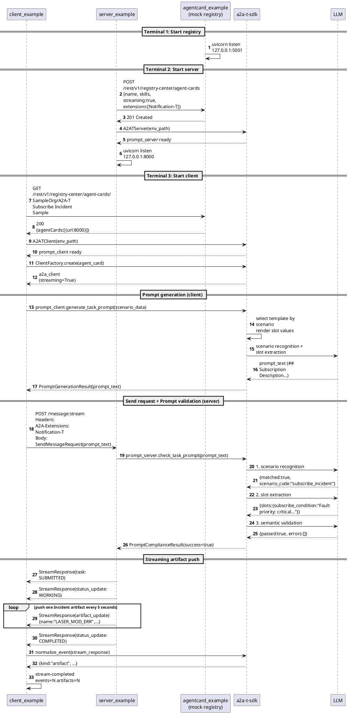

# A2A-T Sample

A minimal end-to-end sample based on a2a-t-sdk, demonstrating a **streaming incident subscription** scenario: client generates prompt -> server validates -> streaming Incident artifact push.

[中文文档](README-zh.md)

## Directory Structure

```
a2a-t-sample/
├── src/
│   ├── agentcard_example/   # mock registry (AgentCard register/query)
│   ├── client_example/      # client (discover agent + generate prompt + consume stream)
│   ├── server_example/      # server (register agent + validate prompt + push artifact)
│   └── common/              # shared modules (LLM logger, mock, a2a adapter, etc.)
├── test/                    # unit tests
├── resources/
│   └── mock_responses/      # mock LLM response data (zh-CN / en-US)
├── env.example              # environment config template
├── requirements.txt         # sample dependencies
└── ruff.toml                # lint config
```

## Quick Start

### 1. Prepare environment

```bash
cd a2a-t-sample
cp env.example .env
```

Edit `.env` and fill in your LLM API key:

```
A2AT_LLM_API_KEY=sk-your-real-key
```

> If the key is left empty, the sample automatically uses mock LLM responses from `resources/mock_responses/`. No real API key is needed to run the full flow.

### 2. Install dependencies

```bash
uv pip install -r requirements.txt
```

### 3. Start services (three terminals)

```bash
# Terminal 1: start registry
uv run python -m agentcard_example.registry_main

# Terminal 2: start server
uv run python -m server_example.server_main

# Terminal 3: start client
uv run python -m client_example.client_main
```

The client will continuously receive artifacts. Press `Ctrl+C` to stop.

### 4. Limit received count (optional)

Control how many artifacts the client receives before auto-stopping via an environment variable:

```bash
A2AT_SAMPLE_MAX_ARTIFACTS=5 uv run python -m client_example.client_main
```

## Sequence Diagram



## Flow Summary

| Stage | Who calls SDK | What SDK does | LLM calls |
|-------|--------------|---------------|-----------|
| Startup | client + server | A2ATClient / A2ATServer init | 0 |
| Prompt generation | client | scenario recognition + slot extraction + template render | 2 |
| Prompt validation | server | scenario recognition -> slot extraction -> semantic validation | 3 |
| Streaming push | client | normalize_event for stream events | 0 |

## Mock LLM

When `A2AT_LLM_API_KEY` is empty, the sample automatically uses pre-built response data from `resources/mock_responses/`. No real API key is needed. Mock responses are organized by language (`zh-CN` / `en-US`), matching the `A2AT_LANGUAGE` setting in `.env`.

## Key Points

- **SDK as middleware**: client/server never call LLM directly; they go through A2ATClient/A2ATServer
- **LLM only for prompt phase**: no LLM calls during artifact push
- **No negotiation**: client submits complete input; server validates and pushes directly
- **Receive control**: set `A2AT_SAMPLE_MAX_ARTIFACTS` to limit count; unset = continuous (Ctrl+C to stop)
- **Three-layer decoupling**: client (discover + consume) -> server (register + push) -> registry (registry center)

## Run Tests

```bash
uv run pytest a2a-t-sample/test/ -v
```
